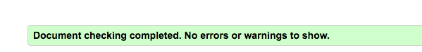

# Worlds-Bookstore-and-Cafe

Worlds is a fictional bookstore founded by a Maya Kirk, a self-proclaimed book worm
who decided to open a bookstore on the outskirts of Cork’s busy city center.
She decided to create a quite little place where customers could come browse the shelves and then sit down with a warm beverage and enjoy there purchases. 

You can visit the deployed site [here](https://daniellaminyo.github.io/Project-1-Milestone/).

## 1. UX

### 1.1. Project Goals
This website was made for the bookstore to attract more customers and let existing customers know of discounts as they occur.
This site was also made for existing and potential customers who want to learn more about the bookstore,
it's location and contact information.

### 1.2. User stories
- As a user of the site, I'd like to easily find the information I am looking for.
- As a potential customer, I'd like to easily navigate throughout the site.
- As a potential customer, I want to learn more about the bookshop.
- As a customer, I'd like to easily sign up for the bookstore's newsletter.

### 1.3. Wireframes
The wireframes were made using [Balsamiq](https://balsamiq.com/). I originally did not intend to make a gallery page so I didn't make any wireframes for it.

[Home](wireframes/home.png)
[About](wireframes/about.png)
[Contact](wireframes/contact.png)

## 2. Features

### 2.1. Existing features

**Header**
- Brand name: allows users to navigate to the home page by clicking on the brand.
- Social media icons: allows users to navigate to the bookstores social media pages, as the bookshop is fictional the link takes the user to the social media platform displayed on the icon.
- Navbar: A navigation bar that shows the site's user which page they are currently on on tablet and desktop and a hamburger menu on mobile devices. 

**Home page**
- Contains the slogan of the bookstore and information on it's departments (new books, second-hand books and it's cafe). 

**About page**
- Provide information on the bookstore, it's founder and values.

**Gallery page**
- Showcases photos of the bookstore, it's cosy interior and cafe to increase interest and motivate people to come.

**Contact page**
- Contact form: allows users to get in contact with the bookshop.
- Map: allow users to know where the bookshop is located. As
 this is a fictional bookshop the map is just a general map of Cork.
- Contact information: allows users to get in contact with the bookshop.

**Footer**
- Newsletter signup form: allows users to signup to the bookstore's newsletter
- Copyright

### 2.2. Features to implement
- An in-store page: where the books currently available in-store are listed
- A pop up window: that allows you to sign up for the newsletter

## 3. Technologies used
- [GitHub](https://github.com/) - was used to host the project.
- [Gitpod](https://gitpod.io/) - was used to develop the website.
- [Balsamiq](https://balsamiq.com/) - was used to create the project's wireframes.
- [HTML5](https://en.wikipedia.org/wiki/HTML5) - provides the structure and content for the site.
- [CSS3](https://en.wikipedia.org/wiki/Cascading_Style_Sheets) - provides the styling for the site.
- [Bootstrap](https://getbootstrap.com/) - was used to create the layout for the site.
- [Google Fonts](https://fonts.google.com/) - was used to provide the fonts for the site.
- [Font Awesome](https://fontawesome.com/) - was used to add social media font awesome icons.

## 4. Testing

### Code Validators

#### [HTML validator](https://validator.w3.org/)

This error occured for every HTML page.

It was solved by renaming the two seperate label's for attribute to the id used in the input tag below that particular label.

**Home page + About page + Gallery page**

No further warnings or errors occured besides the one above.

**Contact page**

I solved the errors by removing the frameborder attribute and put the height into the style tag.

No further warnings or errors occured.

#### [CSS validator](https://jigsaw.w3.org/css-validator/)

No errors occured, a warning popped up but I decided to ignore it as --maincolor was a design decision. 

### Responsiveness

- Galaxy S5 - Good
- iPhone 5/6/7/8 - Good
- iPad - Good
- iPad Pro - Good
- Desktop 1024px - Good
- Desktop >1200px - Good

### Browser compatibility
- Chrome: Responsiveness and Appearance - Good
- Ecosia: Responsiveness and Appearance - Good
- Safari: Responsiveness and Appearance - Bad

### Testing user stories
As a user of the site, I'd like to easily find the information I am looking for.
- The site is easily navigable with the navigation bar in the header.

As a potential customer, I'd like to easily navigate throughout the site.
- The site is easily navigable with the navigation bar in the header.

As a potential customer, I want to learn more about the bookshop.
- The site has an about page where information about the bookshop and it's owner can be found.

As a customer, I'd like to easily sign up for the bookstore's newsletter.
- In the footer section there is a form where users can easily signup for the bookshop's newsletter.

### Bugs
- When browsing the site on Safari the appearance of the home and about page, particularly the images get missplaced, the layout and the sizing are effected. The brand name on sizes medium and large is missplaced to the left.

## 5. Deployment
Deploying the project

Select settings on the menu at the top of repository.
Find the Githup pages section.
Click on the menu under Source and the select master branch then click save.
The website is now deployed.
The link to the site can be found in settings in the Github pages section.

Running the project locally

First you must clone this project.
Under the menu click on the Code dropdown menu.
In the https section, copy the url.
In your local terminal open Git Bash.
Change your working directory to the one where you want to clone the directory.
Type in git clone and then paste in the url you copied.
Then just press enter.

## 6. Credits

### 6.1. Content
I got the header from [code with erum](https://codepen.io/EJW4/pen/xxOjdKm) to which I only made a few modifications.
I used the map I found on https://mdbootstrap.com/docs/b4/jquery/javascript/google-maps/ with only one modification.
I took a lot of inspiration from https://www.w3schools.com/
For the readme file I took a lot of inspiration from https://github.com/fernandagil/ms1-nonnapepita-restaurant/blob/master/README.md
I took some text from [Powell's](https://www.powells.com/info/about-us)
### 6.2. Media
The pictures I used on this site are free stock images from [Unsplash](https://unsplash.com/)
### 6.3. Acknowledgements
My mentor [Precious Ijege](https://www.linkedin.com/in/precious-ijege-908a00168/?originalSubdomain=ng) for the support.